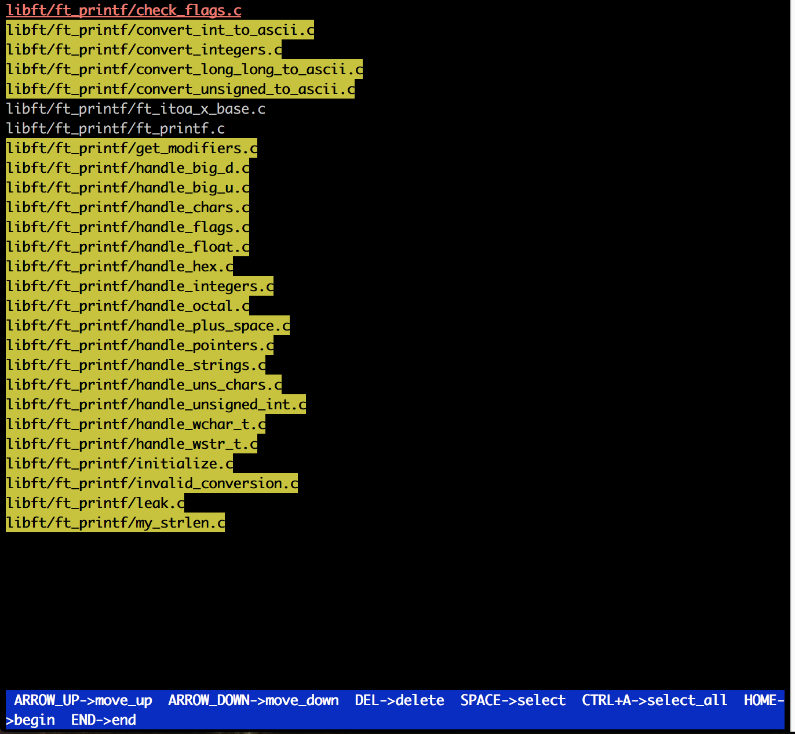

# ft_select
#### TERMCAP is a library and data base that enables programs to use display terminals in a terminal-independent manner
#### It'a a database that lists the capabilities of many different types of terminals 
##### The _tgetent()_ function looks up the termcap entry for name. The emulation ignores the buffer pointer bp.  
##### The _tgetflag()_ function gets the boolean entry for id.  

##### The _tgetnum()_ function gets the numeric entry for id.  

##### The _tgetstr()_ function gets the string entry for id. If area is not a null pointer and does not point to a null pointer,   tgetstr() copies the string entry into the buffer pointed to by *area and advances the variable pointed to by area to the  first byte after the copy of the string entry.  

##### The _tgoto()_ function instantiates the parameters col and row into the capability cap and returns a pointer to the resulting   string.
#### STEPS:
1. Setting the terminal;
2. Get signals;
3. Create the list of the arguments;
4. Print the list;
5. Do keyhooks;
6. End seesion and set terminal back.

#### **Setting terminal in noncanonical mode:**
  1. Look up the description of the terminal type in use, using tgetent() and tgetent(); 
  2. Get the parrameters (key pressed immediately by the user) using tcgetattr() 
  3. Setting the terminal into nonconincal mode, allows to set how many characters should be read 
    before input is given to the program. (&= ~ICANON) unset a flag using bit mask operation; 
    ICANON - "line editing" mode, terminal buffers line at a time; 
    ECHO - controls wheter input is immediately re-echoed as output; 
  4. Set buffer size to 1 byte and time wait to 0 sec, (VMIN, VTIME) 
  5. Set the attributes of the terminal making change immediately; 
  6. Extract information we will use using tgetstr(), tputs(); 

